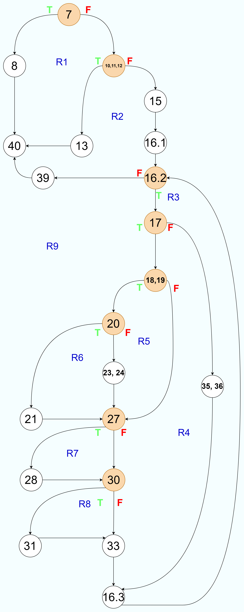

# Втора лабораториска вежба по Софтверско инженерство
## Димитрија Тимески, бр. на индекс 203235

### Control Flow Graph
Фотографија од control flow graph-ot


### Цикломатска комплексност
#### Прв Начин:
Number of region  
Имаме 9 региони во сликата ги означив со сина боја и голема латинична буква "R", тоа е и цикломатската комплексност.  
#### Втор Начин:
V(G) = E – N + 2  
Е = 28 е бројот на гранки/ребра  
N = 21 е бројот на јазли  
V(G) = 28 – 21 + 2 = 9
#### Трет Начин:
V(G) = P + 1  
P = 8 е бројот на предикатни јазли, ги означив со портокалова боја  
V(G) = 8 + 1 = 9  


### Тест случаи според критериумот Every Statement
| C0 - Every Statement  | list = [] | "list = [""0"",""0"",""0"",""0"",""0"",""0""]" | "list = [""0"", ""#"", ""0"", ""0"", ""0"", ""#"", ""#"", ""0"", ""#""]" | 
|-----------------------|-----------|------------------------------------------------|--------------------------------------------------------------------------|
| 7                     | *         | *                                              | *                                                                        |
| 8                     | *         |                                                |                                                                          |   
| 10,11,12              |           | *                                              | *                                                                        |   
| 13                    |           | *                                              |                                                                          |   
| 15                    |           |                                                | *                                                                        |   
| 16.1                  |           |                                                | *                                                                        |  
| 16.2                  |           |                                                | *                                                                        |  
| 16.3                  |           |                                                | *                                                                        |   
| 17                    |           |                                                | *                                                                        |  
| 18,19                 |           |                                                | *                                                                        |   
| 20                    |           |                                                | *                                                                        | 
| 21                    |           |                                                | *                                                                        | 
| 23,24                 |           |                                                | *                                                                        | 
| 27                    |           |                                                | *                                                                        | 
| 28                    |           |                                                | *                                                                        |  
| 30                    |           |                                                | *                                                                        |   
| 31                    |           |                                                | *                                                                        |  
| 33                    |           |                                                | *                                                                        |  
| 35,36                 |           |                                                | *                                                                        |  
| 39                    |           |                                                | *                                                                        |  
| 40                    | *         | *                                              | *                                                                        |  


### Тест случаи според критериумот Every Branch

| C1 - Branch Statement | list = [] | "list = [""0"",""0"",""0"",""0"",""0"",""0""]" | "list = [""0"", ""#"", ""0"", ""0"", ""0"", ""#"", ""#"", ""0"", ""#""]" |  
|-----------------------|-----------|------------------------------------------------|--------------------------------------------------------------------------|
| 7 -- 8                | *         |                                                |                                                                          |  
| 7 -- 10,11,12         |           | *                                              | *                                                                        |  
| 10,11,12 -- 13        |           | *                                              |                                                                          |  
| 10,11,12 -- 15        |           |                                                | *                                                                        |  
| 15 -- 16.1            |           |                                                | *                                                                        |  
| 16.1 -- 16.2          |           |                                                | *                                                                        | 
| 16.2 -- 17            |           |                                                | *                                                                        | 
| 16.2 -- 39            |           |                                                | *                                                                        |  
| 17 -- 18,19           |           |                                                | *                                                                        | 
| 17 -- 35,36           |           |                                                | *                                                                        | 
| 18,19 -- 20           |           |                                                | *                                                                        |   
| 18,19 -- 27           |           |                                                | *                                                                        | 
| 20 --  21             |           |                                                | *                                                                        |  
| 20 --  23,24          |           |                                                | *                                                                        |  
| 21 --  27             |           |                                                | *                                                                        |  
| 23,24 -- 27           |           |                                                | *                                                                        |  
| 27 -- 28              |           |                                                | *                                                                        |   
| 27 -- 30              |           |                                                | *                                                                        |  
| 28 -- 30              |           |                                                | *                                                                        |  
| 30 -- 31              |           |                                                | *                                                                        |   
| 30 -- 33              |           |                                                | *                                                                        |  
| 31 -- 33              |           |                                                | *                                                                        |  
| 33 -- 16.3            |           |                                                | *                                                                        |
| 35,36 -- 16.3         |           |                                                | *                                                                        |  
| 16.3 -- 16.2          |           |                                                | *                                                                        |  
| 8 -- 40               | *         |                                                |                                                                          |  
| 13 -- 40              |           | *                                              |                                                                          |  
| 39 -- 40              |           |                                                | *                                                                        |  


### Објаснување на напишаните unit tests
Поради фактот што и Every Branch и Every Statement тестовите ги опфатив со 3 тест случаи, ги споив тестовите во една функција и ја нареков testEveryStatementAndEveryBranch() .
#### Тест случај 1.

```java
        List<String> emptyList = createList();
        IllegalArgumentException ex;
        ex = assertThrows(IllegalArgumentException.class, () -> SILab2.function(emptyList));
        assertTrue(ex.getMessage().contains("List length should be greater than 0"));
```
Во првиот тест случај создадов нова празна листа со помошната функција createList() која изгледа вака:
```java
        private List<String> createList(String... elems) {
        return new ArrayList<>(Arrays.asList(elems));
    }
```
Потоа направив објект од класата IllegalArgumentException, поради тоа што самата програма фрла исклучок од овој тип,
со assertThrows проверувам дали навистина програмата ќе го фрли овој исклучок и одговорот го зачувувам во променливата ex.
Откако тоа ќе се случи ќе проверам дали навистина во фрлениот исклучок ќе се појави стрингот "List length should be greater than 0".


#### Тест случај 2.
```java
        List<String> nonPerfectSquareList = createList("0", "0", "0", "0", "0", "0");
        ex = assertThrows(IllegalArgumentException.class, () -> SILab2.function(nonPerfectSquareList));
        assertTrue(ex.getMessage().contains("List length should be a perfect square"));
```
Во вториот тест случај направив листа чиј број на елементи не доведува до совршен квадрат.  
Квадратен број или совршен квадрат е цел број кој е квадрат на цел број; со други зборови, тој е производ на некој цел број со себе.

Во вториот исклучок што го фрла програмата, заклучив дека за да продолжи извршувањето на кодот, листата мора да има број на елементи кој прави совршен квадрат откако ќе се степенува.
Затоа создадов листа која има 6 елементи - не постои цел број степенуван на 2 кој ќе го даде бројот 6.

Остатокот е ист како во првиот тест случај, но се проверува со assertTrue дали исклучокот фрлен ќе го сочинува стрингот "List length should be a perfect square" во себе.


#### Тест случај 3.
```java
        List<String> PerfectSquareList = createList("0", "#", "0", "0", "0", "#", "#", "0", "#");
        List<String> correctList = createList("1", "#", "2", "1", "2", "#", "#", "2", "#");
        assertArrayEquals(correctList.toArray(), SILab2.function(PerfectSquareList).toArray());
```

Третиот тест случај е поразличен од претходните 2 со тоа што треба да провериме дали функцијата ќе ја даде очекуваната листа. 

#### Влез - createList("0", "#", "0", "0", "0", "#", "#", "0", "#");
|  |  |  |  
|---|---|---|
| 0 | # | 0 |  
| 0 | 0 | # |  
| # | 0 | # |

#### Излез - createList("1", "#", "2", "1", "2", "#", "#", "2", "#");
|  |  |  |  
|---|---|---|
| 1 | # | 2 |  
| 1 | 2 | # |  
| # | 2 | # |

Со командата assertArrayEquals() проверувам дали листите се идентични, ама поради тоа што оваа команда проверува само низи а јас работам со листи, првин ги конвертирам со .toArray().
Со ова сеопфатно програмата ќе влезе во сите можни if-ови и во сите можни else-ови.

Дообјаснување зошто:

```java
if ( (i % rootOfN != 0 && list.get(i - 1).equals("#")) || (i % rootOfN != rootOfN - 1 && list.get(i + 1).equals("#")) ) {
                    if ( (i % rootOfN != 0 && list.get(i - 1).equals("#")) && (i % rootOfN != rootOfN - 1 && list.get(i + 1).equals("#")) ){
                        num += 2;
                    }
                    else {
                        num  += 1;
                    }
                }
```
Во првиот if, поставуваме прашање дали полето има од неговата лева страна бомба ("#") или дали полето има од неговата десна страна бомба.
Ако било кое од овие две е точно, продолжуваме на вториот вгнезден if и проверуваме дали и на левата и на десната страна се наоѓа бомба.  
 - Ако да - бројот се зголемува за 2  
 - Ако не - бројот се зголемува за 1

```java
if (i - rootOfN >= 0 && list.get(i - rootOfN).equals("#")){
                    num++;
}
if (i + rootOfN < n && list.get(i + rootOfN).equals("#")){
                    num++;
}
```

Во овој дел, првиот if поставува прашање дали над него се наоѓа бомба, ако да - бројачот за бомби се зголемува за 1.  
Во вториот if поставува прашање дали под него се наоѓа бомба, ако да - бројачот за бомби се зголемува за 1.


